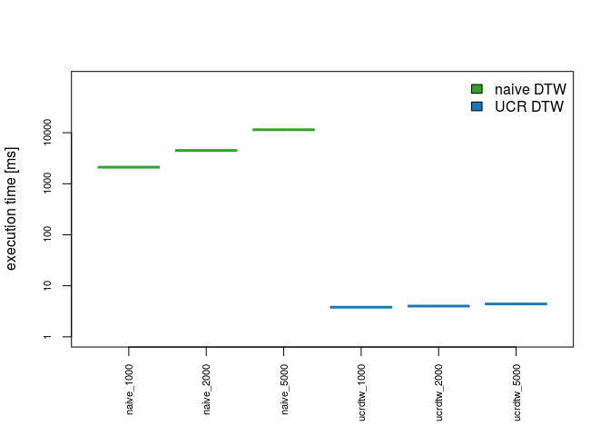

# Summary
Dynamic Time Warping (DTW) methods provide algorithms to optimally map a given time series onto all or part of another time series [@berndt1994using]. The remaining cumulative distance between the series after the alignement is a useful distance metric in time series data mining applications for tasks such as classification, clustering, and anomaly detection. 

Calculating a DTW alignment is computationally relatively expensive, and as a consequence DTW is often a bottleneck in time series data mining applications. The [UCR Suite](http://www.cs.ucr.edu/~eamonn/UCRsuite.html) [@rakthanmanon2012searching] provides a highly optimized algorithm for best-match subsequence searches that avoids unnecessary distance computations and thereby enables fast DTW and Euclidean Distance queries even in data sets containing trillions of observations.
  
  A broad suite of DTW algorithms is implemented in R in the [`dtw` package](https://CRAN.R-project.org/package=dtw) [@giorgino2009computing]. The `rucrdtw` R package provides complementary functionality for fast similarity searches by providing R bindings for the UCR Suite via `Rcpp` [@Rcpp]. In addition to queries and data stored in text files, `rucrdtw` also implements methods for queries and/or data that are held in memory as R objects, as well as a method to do fast similarity searches against reference libraries of time series.

  
# References
  
